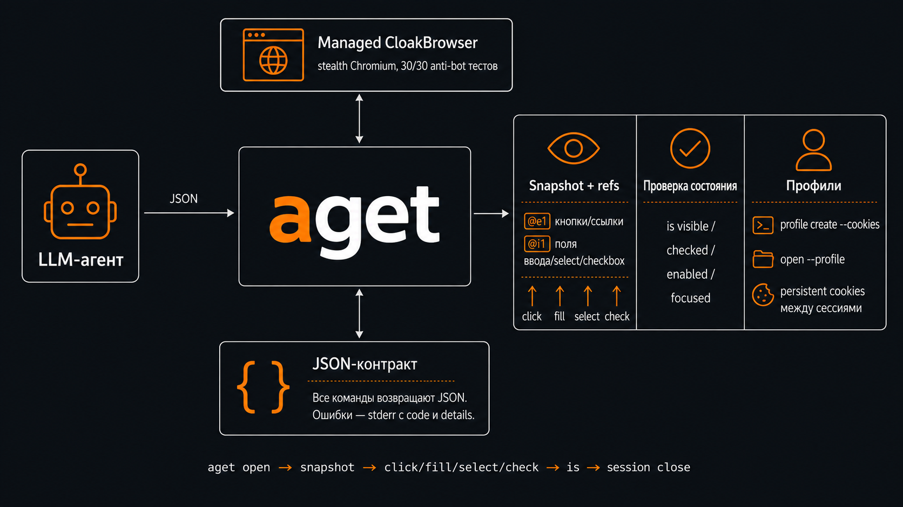

# agent-aget

[](https://github.com/izzzzzi/agent-aget/actions/workflows/ci.yml)
[](https://github.com/izzzzzi/agent-aget/releases)
[](https://www.npmjs.com/package/agent-aget)
[](LICENSE)

Язык: Русский | [English](README.en.md)

`aget` - помощник для браузерных сценариев LLM-агентов. CLI запускает управляемый [CloakBrowser](https://github.com/CloakHQ/CloakBrowser) stealth Chromium, хранит локальные сессии и возвращает машинно-читаемый JSON.



## Установка

```bash
npm i -g agent-aget
aget version
```

При `npm i -g agent-aget` пакет скачивает native `aget` и пытается установить pinned CloakBrowser в пользовательский cache. [Upstream CloakBrowser](https://github.com/CloakHQ/CloakBrowser) описывает себя так: "Stealth Chromium that passes every bot detection test. Drop-in Playwright replacement with source-level fingerprint patches. 30/30 tests passed." Если сеть недоступна, установка пакета не падает; браузер можно поставить позже:

```bash
aget browser install
aget browser status
aget browser path
```

Порядок выбора браузера:

1. `--browser-path`
2. `AGET_BROWSER_PATH`
3. managed CloakBrowser из cache
4. legacy managed Chrome for Testing из cache, если он был установлен ранними версиями `aget`
5. системный Chrome/Chromium

Чтобы пропустить установку managed browser:

```bash
AGET_SKIP_BROWSER_DOWNLOAD=1 npm i -g agent-aget
```

Для локальной разработки:

```bash
go run ./cmd/aget version
```

## Быстрый старт

Откройте страницу и сохраните `sid` из ответа:

```bash
aget open https://example.com -n example
```

По умолчанию браузер запускается в headless-режиме. Для видимого окна используйте:

```bash
aget open https://example.com -n example --headful
```

Для мобильных и планшетных страниц используйте `--device` (согласованный viewport + user-agent + touch для сохранения stealth):

```bash
aget open https://m.site.ru --device mobile
aget open https://m.site.ru --device tablet
```

Чтобы зайти с куками (Netscape-файл или inline):

```bash
aget open https://example.com -n example --cookies cookies.txt
aget open https://example.com -n example --cookies "session=abc; token=xyz"
```

## Профили

Профиль — именованная директория Chromium с persistent cookies, localStorage и сессионными данными. Создайте профиль один раз и переиспользуйте в разных сессиях, сохраняя авторизованное состояние.

```bash
# Создать профиль с куками (браузер запустится, инжектит куки и закроется)
aget profile create ozon --cookies ozon-cookies.txt

# Создать пустой профиль (можно залогиниться вручную через --headful)
aget profile create samokat

# Просмотр
aget profile list
aget profile show ozon

# Открыть страницу с профилем (куки уже внутри)
aget open https://ozon.ru --profile ozon

# Удалить профиль и все его данные
aget profile delete ozon
```

Один профиль не может использоваться двумя сессиями одновременно — вторая попытка вернёт ошибку.

## Команды страницы

Для действий сначала сделайте snapshot. Он возвращает refs вроде `@e1` и `@i1`:

```bash
aget page snapshot -s SID
aget page click -s SID --ref @e1
aget page fill -s SID --ref @i1 --text TEXT
```

Прочитать текущую страницу:

```bash
aget page read -s SID
aget page read -s SID --limit 40
```

#### Очистка шума (`--clean`)

Для read-heavy задач `--clean` убирает boilerplate-шум из текста страницы (cookie-баннеры, навигацию, повторяющиеся строки) и экономит токены. Работает **в Go-слое над уже захваченным текстом** — не трогает живой DOM, поэтому stealth не страдает. Это снижение шума, не защита от prompt injection и не маскировка PII.

```bash
# Разовая очистка для одного read
aget page read -s SID --clean

# Включить для всей сессии
aget open https://example.com --clean
AGET_CLEAN=1 aget open https://example.com

# Отключить, если кажется что пропал нужный контент
aget page read -s SID --no-clean
```

Очистка выключена по умолчанию и только удаляет не-основные строки (точные дубли и известные паттерны chrome) — основной контент не трогается. В ответе появляются `clean_enabled` и `clean_dropped` (сколько строк убрано). Приоритет: `--no-clean` > `--clean` > `AGET_CLEAN` > значение сессии.

### Семантические локаторы (`find`)

`find` находит элемент по ARIA-роли, имени, тексту, placeholder или testid — устойчивее CSS и понятнее агенту. Только чтение DOM, без мутации (stealth сохраняется). Можно сразу выполнить действие через `--action`.

```bash
# Найти и вернуть селектор
aget page find -s SID --role button --name "Submit"
aget page find -s SID --text "Подробнее"
aget page find -s SID --testid submit-btn

# Найти и сразу действовать (click/fill/type/select/check/uncheck/hover/focus)
aget page find -s SID --role button --name "Submit" --action click
aget page find -s SID --placeholder "Email" --action fill --action-text me@example.com
aget page find -s SID --role combobox --name "City" --action select --value "Москва"

# Несколько совпадений — уточнить через --nth (1-based)
aget page find -s SID --role link --name "Details" --nth 2 --action click
```

Критерии комбинируются по AND. Если совпадений несколько и `--nth` не задан — ошибка `locator_ambiguous`; если ноль — `locator_no_match`.

### Ввод и взаимодействие

```bash
# Клик по CSS-селектору
aget page click -s SID --selector "button[type=submit]"

# Клик с форсированным CDP mouse-событием (для кастомных jQuery/React-компонентов)
# Использует Input.dispatchMouseEvent с реальными координатами, обходя event.isTrusted
aget page click -s SID --selector ".custom-widget" --force

# Посимвольный ввод
aget page type -s SID --selector "input[name=q]" --text "agent browser workflow"
aget page type -s SID --ref @i1 --text TEXT

# Очистить и заполнить
aget page fill -s SID --ref @i1 --text TEXT

# Нажатие клавиши
aget page press -s SID --key Enter
```

### Выпадающие списки, чекбоксы и радио

```bash
# Выбор опции в <select>
aget page select -s SID --ref @i1 --value VALUE
aget page select -s SID --selector "select[name=direction]" --value "Backend"

# Чекбоксы и радио (идемпотентно: click только если состояние другое)
aget page check -s SID --ref @i1
aget page uncheck -s SID --ref @i1
```

### Проверка состояния

```bash
aget page is -s SID --ref @i1 visible
aget page is -s SID --ref @i1 checked
aget page is -s SID --ref @i1 enabled
aget page is -s SID --ref @e1 focused
```

### Наведение, фокус, загрузка файлов, диалоги

```bash
aget page hover -s SID --ref @e1
aget page focus -s SID --ref @i1
aget page upload -s SID --ref @i1 --file /path/to/resume.pdf
aget page dialog-accept -s SID
aget page dialog-accept -s SID --text "ответ"
aget page dialog-dismiss -s SID
```

### Универсальный fallback

```bash
aget page js -s SID --expr "document.querySelector('input[name=x]').click()"
```

### Ожидание, чтение и скролл

```bash
# Ожидание текста на странице
aget page wait -s SID --text "Ready"

# Ожидание появления элемента в DOM (для динамически рендерящихся компонентов)
aget page wait -s SID --appear ".skill-tag"

# Ожидание видимого элемента
aget page wait -s SID --selector ".result"

aget page get -s SID text --ref @e1
aget page get -s SID url
aget page scroll -s SID --direction down --px 800
```

Сделать скриншот:

```bash
aget page screenshot -s SID
aget page screenshot -s SID --path /tmp/page.png
```

Выполнить несколько шагов одной JSON batch-командой:

```bash
printf '[{"cmd":"click","ref":"@e1"},{"cmd":"wait","text":"Done"}]' | aget batch -s SID --stdin
```

Проверить установку и диагностику запуска браузера:

```bash
aget doctor
```

Закрыть сессию:

```bash
aget session close -s SID
```

## Примеры для agent CLI

Базовый поток для агента:

```bash
aget open https://example.com -n research
aget page snapshot -s SID
aget page click -s SID --ref @e1
aget page wait -s SID --text "Done"
aget page read -s SID --limit 80
aget session close -s SID
```

Заполнение формы через snapshot refs:

```bash
aget page snapshot -s SID
aget page fill -s SID --ref @i1 --text "agent@example.com"
aget page select -s SID --ref @i2 --value "Backend"
aget page check -s SID --ref @i3
aget page is -s SID --ref @i3 checked
aget page press -s SID --key Enter
aget page get -s SID url
```

Работа с профилем (куки сохраняются между сессиями):

```bash
aget profile create mysite --cookies cookies.txt
aget open https://mysite.com --profile mysite
aget page snapshot -s SID
# ... действия на авторизованной странице ...
aget session close -s SID
```

Многошаговый сценарий одной командой:

```bash
printf '[{"cmd":"snapshot"},{"cmd":"fill","ref":"@i1","text":"agent@example.com"},{"cmd":"press","key":"Enter"},{"cmd":"wait","text":"Ready"},{"cmd":"get","kind":"url"}]' | aget batch -s SID --stdin
```

## Контракт JSON

Операционные команды выводят один JSON-объект в stdout. Ошибки выводятся в stderr и имеют форму:

```json
{"ok":false,"code":"invalid_args","message":"command required","details":{"hint":"run `aget --help` for agent command map or `aget prompt` for full agent instructions"}}
```

Успешные ответы содержат `ok: true`. `aget open` возвращает `sid`, данные браузера, запись сессии и `next_commands` для дальнейших действий.

## Справка для агентов

`aget --help` возвращает JSON-карту команд для LLM-агента, а не обычный Cobra help:

```bash
aget --help
aget page --help
```

Для полной короткой инструкции загрузите prompt:

```bash
aget prompt
aget agent-instructions
```

Все эти команды сохраняют JSON-контракт CLI.

## Примеры для agent CLI

Вставьте эту инструкцию в Codex, Claude Code, OpenCode или другой terminal agent перед браузерной задачей:

```text
Используй `aget` для браузерных задач.

Сначала получи краткую инструкцию:
aget prompt

Открой нужный URL:
aget open URL -n NAME

Сохрани returned sid. Для понимания страницы сначала используй:
aget page read -s SID --limit 80
Для read-heavy задач добавь --clean чтобы убрать boilerplate и сэкономить токены; --no-clean если контент пропал:
aget page read -s SID --limit 80 --clean

Для действий предпочитай snapshot refs перед CSS-селекторами:
aget page snapshot -s SID
aget page click -s SID --ref @e1
aget page fill -s SID --ref @i1 --text TEXT
aget page select -s SID --ref @i1 --value VALUE
aget page check -s SID --ref @i1

Проверяй состояние элементов:
aget page is -s SID --ref @i1 visible
aget page is -s SID --ref @i1 checked

Если важен визуальный вид, состояние layout, canvas, captcha или страница плохо читается текстом, сделай screenshot:
aget page screenshot -s SID --path /tmp/page.png

Если refs недоступны, используй CSS-селекторы:
aget page click -s SID --selector CSS
aget page type -s SID --selector CSS --text TEXT

Для сохранения авторизации между сессиями используй профили:
aget profile create mysite --cookies cookies.txt
aget open URL --profile mysite

Для многошаговых workflow используй:
aget page wait -s SID --text TEXT
aget page get -s SID text --ref REF
aget page scroll -s SID --direction down --px 800
aget batch -s SID --stdin

Если установка или запуск браузера не работают:
aget doctor

Всегда закрывай сессию после работы:
aget session close -s SID

Не повторяй чувствительный текст из форм, cookies, tokens или private pages. Продолжай workflow через returned sid и next_commands.
```

Короткие варианты для популярных CLI:

```text
Codex: Используй `aget` для браузерных задач. Начни с `aget open URL -n NAME`, сохрани returned sid, затем используй `aget page snapshot -s SID` и refs для `click/fill/select/check`; проверяй состояние через `aget page is`; для текста используй `aget page read` или `aget page get`, для визуального состояния - `aget page screenshot`. Для авторизованных сессий создай профиль: `aget profile create NAME --cookies FILE` затем `aget open URL --profile NAME`. Закрывай сессию через `aget session close -s SID`.
```

```text
Claude Code: Перед browser-work установи/запусти `aget`. Для каждой страницы используй returned sid и JSON `next_commands`; начинай с `aget page snapshot`, действуй через refs (`fill/select/check/is`), используй `page wait/get/scroll/batch` для многошаговых workflow и делай screenshot, когда важен layout или текстового чтения недостаточно. Для read-heavy задач добавь `--clean` к `aget page read` (убирает boilerplate и экономит токены; `--no-clean` если контент пропал). Для постоянных кук — `aget profile create` и `open --profile`.
```

```text
OpenCode: Используй `aget open`, затем `aget page snapshot/read/click/fill/select/check/is/wait/get/scroll/screenshot` с returned sid. Не смешивай sid разных браузерных сессий, запускай `aget doctor` для проблем с браузером и всегда закрывай session после завершения.
```

## Переменные окружения

- `AGET_BROWSER_PATH` - путь к Chromium-совместимому браузеру.
- `AGET_BROWSER_CACHE_DIR` - каталог cache для managed CloakBrowser.
- `AGET_STATE_DIR` - каталог локального состояния, сессий, профилей и артефактов.
- `AGET_CLEAN=1` - включить очистку шума (`--clean`) по умолчанию для `page read`.
- `AGET_SKIP_BROWSER_DOWNLOAD=1` - пропустить установку managed CloakBrowser во время npm `postinstall`.
- `AGENT_AGET_SKIP_DOWNLOAD=1` - dev/test-only: пропустить скачивание native-бинаря в npm `postinstall` и записать тестовый исполняемый файл.

`aget page screenshot --path` принимает только безопасные пути под `/tmp` или каталогами состояния/artifacts `aget`; без `--path` файл пишется в artifacts-каталог автоматически.

## Лицензия

MIT

## English

See [README.en.md](README.en.md).
